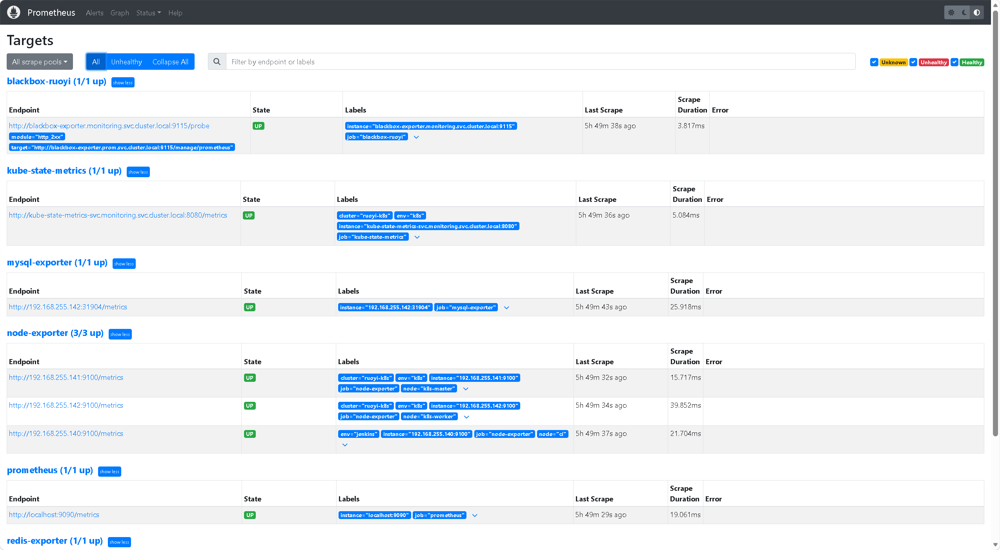
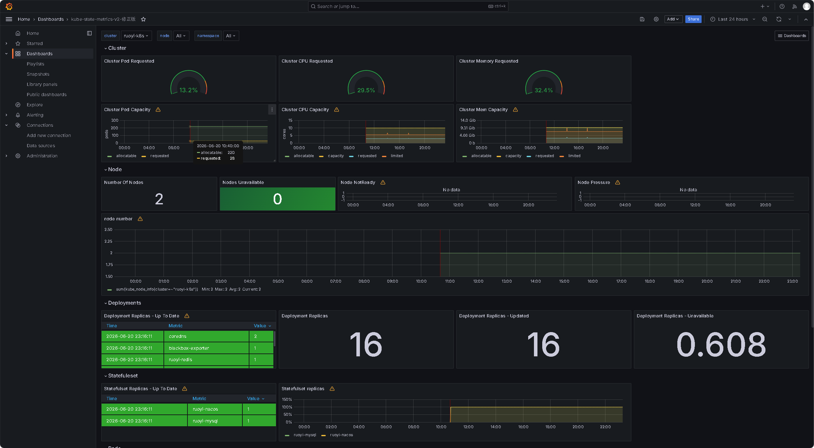
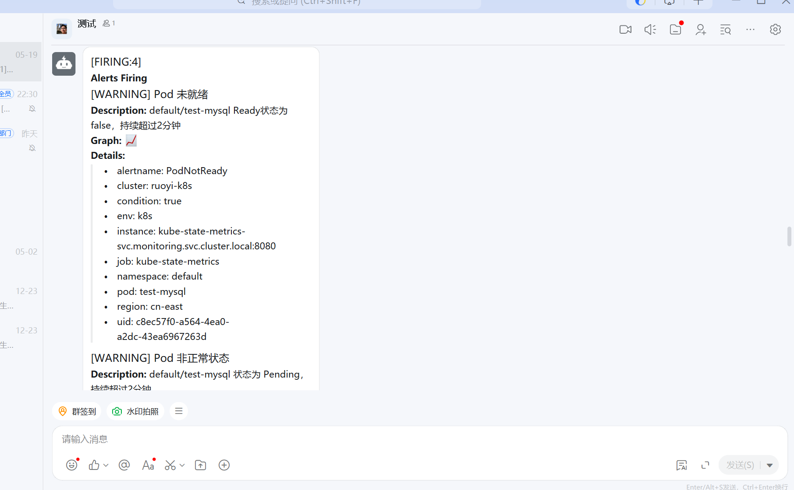
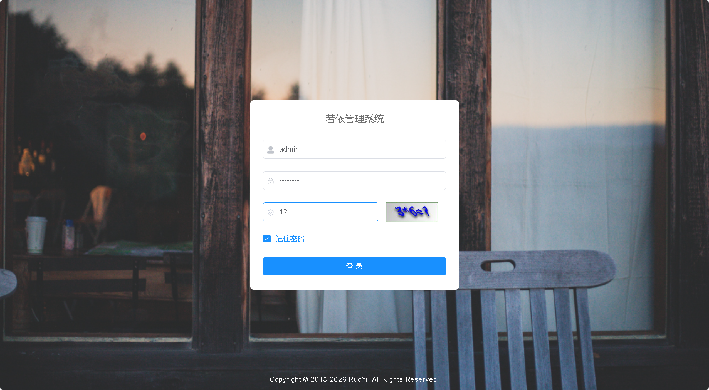
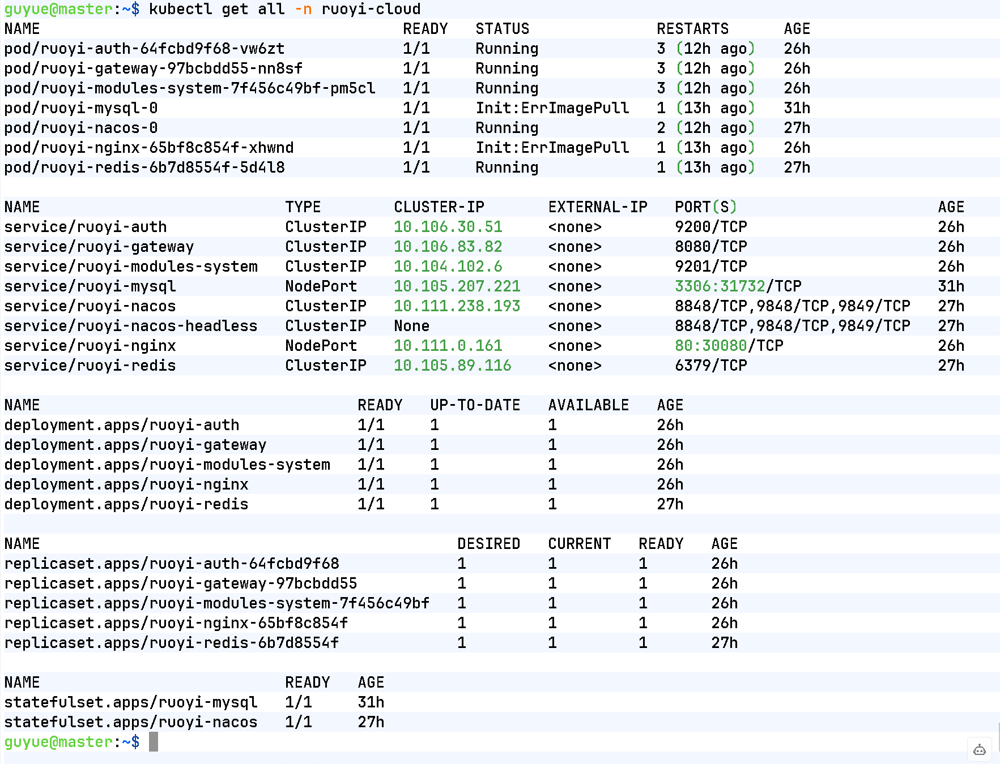
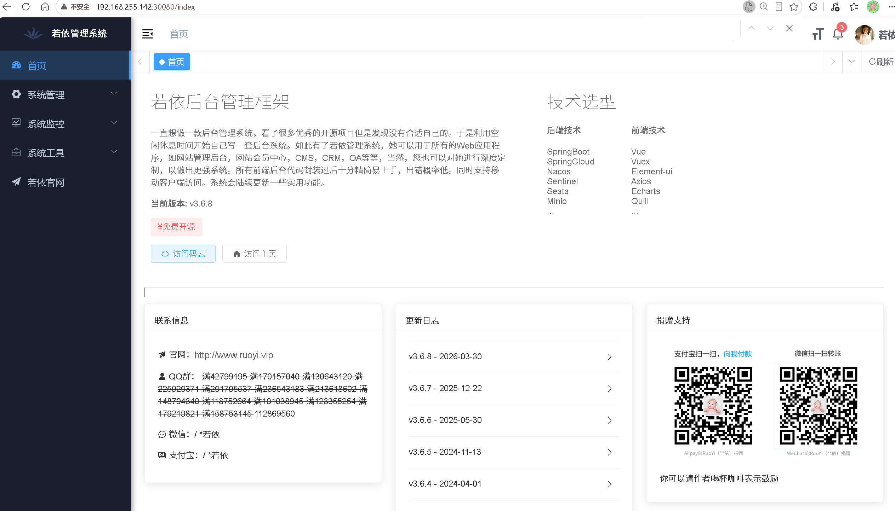
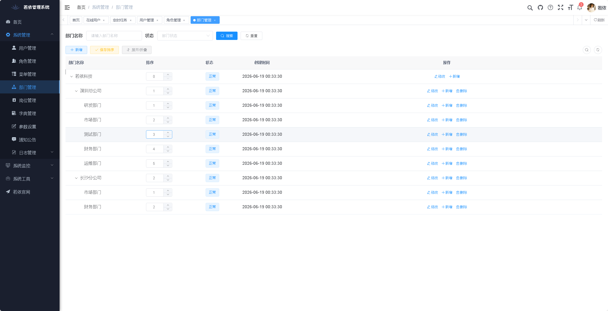
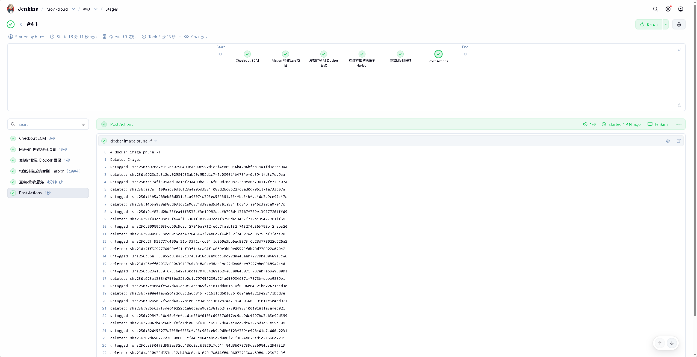

# DevOps 个人实验室

基于 RuoYi-Cloud 微服务项目搭建的两套完整 DevOps 实践环境，涵盖 CI/CD 自动化构建部署与 Prometheus 监控告警体系。

---

## 项目一：CI/CD 自动化构建部署平台

**时间：2026.01 — 2026.03**  
**技术栈：** Jenkins · Docker · Harbor · Kubernetes · Shell

### 架构概览

| 节点 | 职责 |
|------|------|
| CI 节点 | Jenkins + Harbor + Docker |
| K8s Master | 集群控制面 |
| K8s Worker | 业务 Pod 运行 |

### 流水线流程

```
GitHub Push → Jenkins 拉取代码 → Maven 构建
→ Docker 镜像构建 → Harbor 推送
→ kubectl rollout restart → K8s 滚动更新
```

发布耗时由 **30+ 分钟缩短至 5 分钟以内**。

### 主要内容

- **Shell 环境初始化脚本**：一键完成主机名设置、静态 IP 配置、Swap 关闭、镜像源切换、依赖安装，手动运维操作减少 90%
- **Kubernetes 集群**：基于 kubeadm + containerd 从零搭建，部署 Flannel CNI，对接 Harbor 私有镜像仓库
- **中间件 YAML 资源清单**：使用 StatefulSet + PVC 部署 MySQL、Redis、Nacos，通过 InitContainer 控制启动依赖顺序，解决微服务启动竞争问题
- **健康检查与配置管理**：为 Gateway、Auth、System 服务配置 readinessProbe / livenessProbe，结合 Secret 管理敏感配置，实现零停机滚动更新
- **Docker 多阶段构建**：前端镜像分离构建与运行环境，降低镜像体积
- **GitHub Webhook**：Push 事件自动触发 Jenkins Pipeline，SSH 走 443 端口绕过 22 端口封锁

### 目录结构

```
cicd-pipeline/
├── k8s/
│   └── ruoyi-k8s/
│       ├── 00-namespace-and-config.yaml 
│       ├── 01-mysql.yaml                 
│       ├── 02-redis.yaml                
│       ├── 03-nacos.yaml               
│       ├── 04-microservices.yaml         
│       ├── 05-nginx.yaml                 
│       ├── apply.sh                      
│       ├── README.md                     
│       └── test.yml                    
├── shells/
│   └── initEnv.sh                     
└── Jenkinsfile     
```

---

## 项目二：Prometheus 企业级监控告警系统

**时间：2026.04 — 2026.05**  
**技术栈：** Prometheus · Grafana · Alertmanager · Node Exporter · kube-state-metrics · mysqld-exporter · redis-exporter

### 架构概览

| 命名空间 | 职责 |
|------|------|
| prom | Prometheus + Grafana + Alertmanager（Docker 部署） |
| monitoring | 被监控对象（Node Exporter DaemonSet） |

### 采集体系

| Exporter | 采集目标 | 接入方式 |
|----------|----------|----------|
| Node Exporter | 三节点主机（CPU/内存/磁盘/网络） | DaemonSet + hostNetwork |
| kube-state-metrics | K8s 集群资源状态 | K8s 内部署，NodePort 暴露 |
| mysqld-exporter | RuoYi-Cloud MySQL | K8s 内部署，NodePort 31904 |
| redis-exporter | RuoYi-Cloud Redis | K8s 内部署，NodePort 31921 |

### 告警规则覆盖

**node-alerts.yml**：实例宕机、CPU 使用率、内存可用率、磁盘剩余空间

**k8s-alerts.yml**：Pod 非正常状态、Pod CrashLoop、Pod 未就绪、Deployment 副本缺失、Deployment 不可用、Node 未就绪、Node 内存/磁盘压力、StatefulSet 副本缺失、PVC 未绑定

**mysql-alerts.yml**：MySQL 宕机、主从同步异常、主从延迟过大

**redis-alerts.yml**：Redis 宕机、内存使用率过高、连接数过多

### 告警通知

- Alertmanager 对接**钉钉 Webhook**，完成端到端告警链路验证（触发 → 路由 → 钉钉推送）
- 支持 `curl -X POST /-/reload` 热加载规则，无需重启容器

### Grafana Dashboard

| Dashboard | 用途 |
|-----------|------|
| Node Exporter Full | 主机资源总览 |
| kube-state-metrics-v2（修正版） | K8s 集群资源状态（修复 v2 指标兼容性问题） |
| MySQL Overview | MySQL 运行状态 |
| Prometheus Blackbox Exporter | 接口可用性探测 |

### 目录结构

```
monitoring/
├── monitor/
│   ├── blackbox-exporter.yml
│   ├── kube-state-metrics.yml
│   ├── mysql-exporter.yml
│   ├── node-exporter.yml
│   └── redis-exporter.yml
├── prom/
│   ├── blackbox/
│   ├── dingtalk/
│   │   └── config.yml
│   ├── grafana/
│   │   └── provisioning/
│   ├── alertmanager.yml
│   ├── blackbox.yml
│   ├── docker-compose.yml
│   ├── k8s-monitor.yml
│   ├── prom.yml
│   ├── prometheus.yml
│   └── update-conf.sh
└── rules/
    ├── k8s-alerts.yml
    ├── mysql-alerts.yml
    ├── node_alerts.yml
    ├── redis-alerts.yml
    └── ruoyi-alerts.yml
```

---

## 运行截图

> 部分截图








---

## 联系方式

邮箱：xiaobohu978@gmail.com