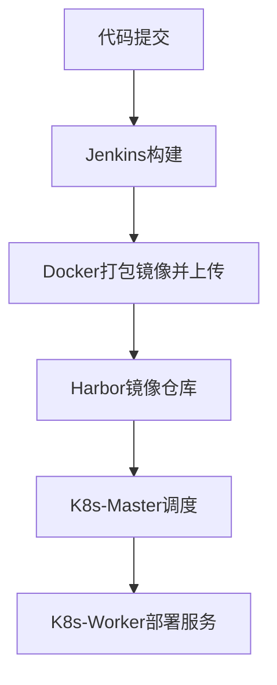

# CI/CD自动部署RuoYiCloud

# 项目系统架构

## 系统架构

|Jobs|Host|Resouce|
|---|---|---|
|Harbor/Jenkins/Docker|192\.168\.255\.140|4C/4G|
|K8s\-Master|192\.168\.255\.141|2C/2G|
|K8s\-Worker|192\.168\.255\.142|2C/2G|

## 项目执行流程



# 初始化系统环境\-ALL

```Bash
#!/bin/bash

if [[ -z "$2" || ! "$2" =~ ^[0-9]{1,3}$ ]]; then
    echo "参数2不合法，必须是1-255"
    exit 1
fi

#设置主机名
sudo hostnamectl set-hostname $1
#初始化基础环境
sudo tee /etc/apt/sources.list <<'EOF'
deb http://mirrors.aliyun.com/ubuntu/ jammy main restricted universe multiverse
deb http://mirrors.aliyun.com/ubuntu/ jammy-security main restricted universe multiverse
deb http://mirrors.aliyun.com/ubuntu/ jammy-updates main restricted universe multiverse
deb http://mirrors.aliyun.com/ubuntu/ jammy-backports main restricted universe multiverse
deb http://mirrors.aliyun.com/ubuntu/ jammy-proposed main restricted universe multiverse
EOF
#1.静态IP配置
#关闭网卡配置自动还原
sudo tee /etc/cloud/cloud.cfg.d/99-disable-network-config.cfg <<EOF
network: {config: disabled}
EOF
#配置静态IP
sudo tee /etc/netplan/50-cloud-init.yaml <EOF
network:
  ethernets:
    ens33:
      dhcp4: no
      addresses:
        - 192.168.255.$2/24
      routes:
        - to: default
          via: 192.168.255.2
      nameservers:
        addresses:
          - 114.114.114.114
          - 8.8.8.8
  version: 2
EOF
sudo netplan apply
#2.关闭防火墙和交换内存
# 停止并禁用 ufw 防火墙
sudo systemctl stop ufw && sudo systemctl disable ufw
# 关闭当前 swap 分区
sudo swapoff -a
# 注释掉 /etc/fstab 里所有包含 swap 的行，永久禁用 swap
sudo sed -i 's/.*swap.*/#&/' /etc/fstab
#3.安装常用工具
sudo apt update && sudo apt install -y \
curl \
wget \
git \
vim \
net-tools \
htop \
apt-transport-https \
ca-certificates \
gnupg
```

各主机执行：`sudo ./initEnv.sh ci 140`

各主机执行：`sudo ./initEnv.sh master 141`

各主机执行：`sudo ./initEnv.sh worker 142`

# CI 节点服务部署\-140

## 安装Docker

```Shell
#安装docker
sudo apt install -y docker
#添加镜像仓库
sudo tee /etc/docker/daemon.json <<'EOF'
{
  "registry-mirrors": ["https://docker.mirrors.ustc.edu.cn"],
  "insecure-registries": ["192.168.255.14o:80"],
  "log-driver": "json-file",
  "log-opts": {"max-size": "50m", "max-file": "3"}
}
EOF
sudo systemctl daemon-reload
sudo systemctl restart docker

#安装docker compose
sudo mkdir -p /usr/local/lib/docker/cli-plugins/
sudo curl -SL https://github.com/docker/compose/releases/latest/download/docker-compose-linux-x86_64 -o /usr/local/lib/docker/cli-plugins/docker-compose
#给予运行权限
sudo chmod +x /usr/local/lib/docker/cli-plugins/docker-compose
```

## 安装Harbor

```Shell
#下载harbor部署包
cd
wget https://github.com/goharbor/harbor/releases/download/v2.9.0/harbor-offline-installer-v2.9.0.tgz
#解压harbor部署包
tar -xzvf harbor-offline-installer-v2.9.0.tgz && cd harbor
#修改配置文件
cp harbor.yml.tmpl harbor.yml
sudo nano harbor.yml
-----------------------------
#主机名
hostname 192.168.255.140
#注释掉整个Https
#https:
#  port: 443
#  certificate: /your/certificate/path
#  private_key: /your/private/key/path
#数据卷目录
data_volume: /data/harbor
-----------------------------
```

使用 `sudo ./install.sh` 开始安装

验证（浏览器访问 http://192\.168\.255\.140 → 登录 admin/Harbor12345）

新建项目→ruoyi\-cloud→public→确定创建

## 安装Jenkins

### 安装\&初始化

首先安装Jenkins对应版本的Java，这里我们选择`Java21`

`sudo apt install -y openjdk-21-java`

`java17`用于构建ruoyi\-cloud项目

`sudo apt install -y openjdk-17-java`

选择刚安装的java21版本

`sudo update-alternatives --config java`

安装构建工具Maven

`sudo apt install maven -y`

验证版本

`java -version`

`mvn -v`

```Markdown

# 下载并安装新的 2026 GPG 密钥
sudo mkdir -p /etc/apt/keyrings
curl -fsSL https://pkg.jenkins.io/debian-stable/jenkins.io-2026.key | sudo tee /etc/apt/keyrings/jenkins-keyring.asc > /dev/null

# 添加 Jenkins 软件源
echo "deb [signed-by=/etc/apt/keyrings/jenkins-keyring.asc] https://pkg.jenkins.io/debian-stable binary/" | sudo tee /etc/apt/sources.list.d/jenkins.list > /dev/null

#安装并启动Jenkins
sudo apt update
sudo apt install -y jenkins
sudo systemctl start jenkins
```

浏览器访问 http://192\.168\.255\.140:8080 初始化Jenkins

查看初始化管理员密码 `sudo cat /var/lib/jenkins/secrets/initialAdminPassword`

根据提示命令填入对应密码 `a2e8bee33dce4253a218a1eee9d2d592`

安装推荐插件 —\> 创建管理员账号

### 配置插件\&凭证

Jenkins管理—\>插件管理—\>安装表格中插件

Jenkins管理—\>全局工具配置

Jenkins管理—\>凭证管理—\> Add Credentialsd \(添加凭证\)

## WebHook

### 一、安装插件

**系统管理 → 插件管理 → Available plugins** 搜索安装：

- `GitHub`

- `GitHub Integration`

安装后重启 Jenkins。

---

### 二、配置 GitHub Token

生成 Token

GitHub → Settings → Developer settings → Personal access tokens → **Tokens \(classic\)** → Generate new token

权限勾选：

- ✅ `repo`（全部子项）

- ✅ `admin:repo_hook`

填入 Jenkins

**系统管理 → 系统配置 → GitHub → Add GitHub Server**

点 **Test connection** 显示成功后保存。

---

### 三、配置 SSH 密钥

给 jenkins 用户生成密钥

bash

```Bash
sudo su -s /bin/bash jenkins
ssh-keygen -t rsa -b 4096 -C "jenkins"
# 一路回车
cat ~/.ssh/id_rsa.pub  # 复制公钥
```

配置走 443 端口（解决 22 端口被封问题）

bash

```Bash
cat >> ~/.ssh/config << 'EOF'
Host github.com
    Hostname ssh.github.com
    Port 443
    User git
EOF

# 验证
ssh -T git@github.com
# 返回 Hi moyu-777! 说明成功
```

公钥添加到 GitHub

GitHub → Settings → **SSH and GPG keys → New SSH key** → 粘贴公钥保存

私钥添加到 Jenkins 凭据

**系统管理 → 凭据 → 全局 → 添加凭据**

---

### 四、配置 Host Key 验证

**系统管理 → Security → Git Host Key Verification Configuration**

```Plain Text
Host Key Verification Strategy → Accept first connection
```

保存。

---

### 五、创建 Pipeline Job

**新建任务 → Pipeline → 确定**

General

```Plain Text
✅ GitHub project
Project url: https://github.com/moyu-777/ruoyi-cloud/
```

Triggers

```Plain Text
✅ GitHub hook trigger for GITScm polling
```

流水线脚本

groovy

```Groovy
pipeline {
    agent any
    stages {
        stage('拉取代码') {
            steps {
                git branch: 'master',
                    credentialsId: 'github-ssh',
                    url: 'git@github.com:moyu-777/ruoyi-cloud.git'
            }
        }
        stage('构建') {
            steps {
                sh 'ls -la'
                // 后续添加 Maven 构建、Docker 打包等
            }
        }
    }
}
```

保存。

---

### 六、GitHub 添加 Webhook

GitHub 仓库 → **Settings → Webhooks → Add webhook**

添加后出现绿色 ✅ 说明连通成功。

---

### 七、验证

bash

```Bash
cd ~/RuoYi-Cloud
echo "test" >> README.md
git add .
git commit -m "test webhook"
git push
```

推送后 Jenkins 自动触发构建即为成功。

# CD 节点服务部署\-141/142

## 部署K8s

```Bash
# host配置
cat <<EOF | sudo tee -a /etc/hosts
192.168.255.141 master
192.168.255.142 worker
EOF
#关闭交换内存
sudo swapoff -a
sudo sed -i 's/.*swap.*/#&/' /etc/fstab

#2.加载内核模块
cat <<EOF | sudo tee /etc/modules-load.d/k8s.conf
br_netfilter
overlay
EOF

#3.配置内核参数
sudo modprobe br_netfilter
sudo modprobe overlay
cat <<EOF | sudo tee /etc/sysctl.d/k8s.conf
net.bridge.bridge-nf-call-iptables = 1
net.bridge.bridge-nf-call-ip6tables = 1
net.ipv4.ip_forward = 1
EOF
sudo sysctl --system

#4.安装contained
sudo apt install -y containerd
sudo mkdir -p /etc/containerd
containerd config default | sudo tee /etc/containerd/config.toml
# 修改 cgroup driver
sudo sed -i 's/SystemdCgroup = false/SystemdCgroup = true/' /etc/containerd/config.toml
# 替换 pause 镜像为阿里云
sudo sed -i 's|registry.k8s.io/pause:3.6|registry.aliyuncs.com/google_containers/pause:3.6|' /etc/containerd/config.toml
# 3. 配置信任 Harbor HTTP 仓库
#❗️ 将 [plugins.'io.containerd.cri.v1.images'.registry] 替换成以下内容
    [plugins.'io.containerd.cri.v1.images'.registry]
      config_path = ""

      [plugins.'io.containerd.cri.v1.images'.registry.mirrors]
        [plugins.'io.containerd.cri.v1.images'.registry.mirrors."docker.io"]
          endpoint = ["https://registry-1.docker.io"]
        [plugins.'io.containerd.cri.v1.images'.registry.mirrors."192.168.255.140:80"]
          endpoint = ["http://192.168.255.140:80"]

      [plugins.'io.containerd.cri.v1.images'.registry.configs]
        [plugins.'io.containerd.cri.v1.images'.registry.configs."192.168.255.140:80".tls]
          insecure_skip_verify = true
#重启服务
sudo systemctl restart containerd
sudo systemctl enable containerd

#5.安装kubeclt kubelet kubeadm
curl -fsSL https://mirrors.aliyun.com/kubernetes/apt/doc/apt-key.gpg | \
  sudo gpg --dearmor -o /usr/share/keyrings/kubernetes-archive-keyring.gpg
echo "deb [signed-by=/usr/share/keyrings/kubernetes-archive-keyring.gpg] \
  https://mirrors.aliyun.com/kubernetes/apt/ kubernetes-xenial main" | \
  sudo tee /etc/apt/sources.list.d/kubernetes.list
sudo apt update
sudo apt install -y kubelet=1.28.0-00 kubeadm=1.28.0-00 kubectl=1.28.0-00
sudo apt-mark hold kubelet kubeadm kubectl
sudo systemctl enable kubelet

#6.仅在Master节点上初始化
sudo kubeadm init \
  --kubernetes-version=v1.28.0 \
  --apiserver-advertise-address=192.168.255.161 \
  --pod-network-cidr=10.244.0.0/16 \
  --image-repository registry.aliyuncs.com/google_containers
  
#7.仅在Master配置kubectl
mkdir -p $HOME/.kube
sudo cp /etc/kubernetes/admin.conf $HOME/.kube/config
sudo chown $(id -u):$(id -g) $HOME/.kube/config

#8.仅在Master安装Flannel网络插件
# 能访问 GitHub
kubectl apply -f https://raw.githubusercontent.com/flannel-io/flannel/master/Documentation/kube-flannel.yml
  
#9.workd节点加入集群
sudo kubeadm join 192.168.255.161:6443 \
  --token <token> \
  --discovery-token-ca-cert-hash sha256:<hash>

#10.master验证
kubectl get nodes # 两个节点都显示 Ready 即成功
```

# 核心构建实现

## 创建流水线

Jenkins—》新建任务—》流水线，名称：ruoyi\-cloud—》确定

配置任务

源码配置 ✅勾选 Github项目 URL地址：https://github\.com/moyu\-777/ruoyi\-cloud/

Trigger 配置 —》✅勾选 GitHub hook trigger for GITScm polling

**流水线配置**

|SCM|选择|Git|
|---|---|---|
|Repository URL|输入|git@github\.com:moyu\-777/ruoyi\-cloud\.git|
|Credentials|选择|github\-ssh|

## K8s服务配置

### 基础服务

**00\-namespace \&\& secret**

```YAML
apiVersion: v1
kind: Namespace
metadata:
  name: ruoyi-cloud

---
# MySQL & Nacos 共享 Secret
apiVersion: v1
kind: Secret
metadata:
  name: ruoyi-mysql-secret
  namespace: ruoyi-cloud
type: Opaque
stringData:
  MYSQL_ROOT_PASSWORD: "password"
  MYSQL_DATABASE: "ry-cloud"

---
apiVersion: v1
kind: Secret
metadata:
  name: ruoyi-nacos-secret
  namespace: ruoyi-cloud
type: Opaque
stringData:
  NACOS_AUTH_TOKEN: "your_auth_token"
  NACOS_AUTH_IDENTITY_KEY: "your_identity_key"
  NACOS_AUTH_IDENTITY_VALUE: "your_identity_value"

```

**01\-MySQL**

```Bash
apiVersion: v1
kind: PersistentVolumeClaim
metadata:
  name: ruoyi-mysql-data
  namespace: ruoyi-cloud
spec:
  accessModes:
    - ReadWriteOnce
  resources:
    requests:
      storage: 10Gi
  storageClassName: nfs-client  # 按需启用

---
apiVersion: apps/v1
kind: StatefulSet
metadata:
  name: ruoyi-mysql
  namespace: ruoyi-cloud
spec:
  serviceName: ruoyi-mysql
  replicas: 1
  selector:
    matchLabels:
      app: ruoyi-mysql
  template:
    metadata:
      labels:
        app: ruoyi-mysql
    spec:
      nodeSelector:
        kubernetes.io/hostname: worker
      containers:
        - name: mysql
          # *.sql 初始化脚本已由 Dockerfile ADD 打包进镜像
          image: 192.168.255.140:80/ruoyi-cloud/ruoyi-mysql:latest
          imagePullPolicy: Always
          ports:
            - containerPort: 3306
          args:
            - mysqld
            - --innodb-buffer-pool-size=80M
            - --character-set-server=utf8mb4
            - --collation-server=utf8mb4_unicode_ci
            - --default-time-zone=+8:00
            - --lower-case-table-names=1
          env:
            - name: MYSQL_ROOT_PASSWORD
              valueFrom:
                secretKeyRef:
                  name: ruoyi-mysql-secret
                  key: MYSQL_ROOT_PASSWORD
            - name: MYSQL_DATABASE
              valueFrom:
                secretKeyRef:
                  name: ruoyi-mysql-secret
                  key: MYSQL_DATABASE
          volumeMounts:
            - name: mysql-data
              mountPath: /var/lib/mysql
          resources:
            requests:
              memory: "256Mi"
              cpu: "250m"
            limits:
              memory: "512Mi"
              cpu: "500m"
          readinessProbe:
            exec:
              command: ["mysqladmin", "ping", "-h", "localhost"]
            initialDelaySeconds: 30
            periodSeconds: 10
      volumes:
        - name: mysql-data
          persistentVolumeClaim:
            claimName: ruoyi-mysql-data

---
apiVersion: v1
kind: Service
metadata:
  name: ruoyi-mysql
  namespace: ruoyi-cloud
spec:
  selector:
    app: ruoyi-mysql
  ports:
    - port: 3306
      targetPort: 3306
  type: ClusterIP
```

**02\-redis**

```YAML
apiVersion: v1
kind: PersistentVolumeClaim
metadata:
  name: ruoyi-redis-data
  namespace: ruoyi-cloud
spec:
  accessModes:
    - ReadWriteOnce
  resources:
    requests:
      storage: 2Gi
  storageClassName: nfs-client  # 按需启用

---
apiVersion: apps/v1
kind: Deployment
metadata:
  name: ruoyi-redis
  namespace: ruoyi-cloud
spec:
  replicas: 1
  selector:
    matchLabels:
      app: ruoyi-redis
  template:
    metadata:
      labels:
        app: ruoyi-redis
    spec:
      nodeSelector:
        kubernetes.io/hostname: worker
      containers:
        - name: redis
          # redis.conf 已由 Dockerfile COPY 打包进镜像
          image: 192.168.255.140:80/ruoyi-cloud/ruoyi-redis:latest
          imagePullPolicy: Always
          command: ["redis-server", "/home/ruoyi/redis/redis.conf"]
          ports:
            - containerPort: 6379
          volumeMounts:
            - name: redis-data
              mountPath: /data
          resources:
            requests:
              memory: "128Mi"
              cpu: "100m"
            limits:
              memory: "256Mi"
              cpu: "200m"
          readinessProbe:
            exec:
              command: ["redis-cli", "ping"]
            initialDelaySeconds: 10
            periodSeconds: 5
      volumes:
        - name: redis-data
          persistentVolumeClaim:
            claimName: ruoyi-redis-data

---
apiVersion: v1
kind: Service
metadata:
  name: ruoyi-redis
  namespace: ruoyi-cloud
spec:
  selector:
    app: ruoyi-redis
  ports:
    - port: 6379
      targetPort: 6379
  type: ClusterIP
```

**03\-nacos**

```YAML
apiVersion: v1
kind: PersistentVolumeClaim
metadata:
  name: ruoyi-nacos-logs
  namespace: ruoyi-cloud
spec:
  accessModes:
    - ReadWriteOnce
  resources:
    requests:
      storage: 2Gi
  storageClassName: nfs-client  # 按需启用

---
apiVersion: apps/v1
kind: StatefulSet
metadata:
  name: ruoyi-nacos
  namespace: ruoyi-cloud
spec:
  serviceName: ruoyi-nacos
  replicas: 1
  selector:
    matchLabels:
      app: ruoyi-nacos
  template:
    metadata:
      labels:
        app: ruoyi-nacos
    spec:
      nodeSelector:
        kubernetes.io/hostname: worker
      initContainers:
        - name: wait-for-mysql
          image: busybox:1.35
          command:
            - sh
            - -c
            - until nc -z ruoyi-mysql 3306; do echo "waiting for mysql..."; sleep 3; done
      containers:
        - name: nacos
          # application.properties 已由 Dockerfile COPY 打包进镜像
          image: 192.168.255.140:80/ruoyi-cloud/ruoyi-nacos:latest
          imagePullPolicy: Always
          ports:
            - containerPort: 8848
              name: http
            - containerPort: 9848
              name: client-rpc
            - containerPort: 9849
              name: raft-rpc
          env:
            - name: MODE
              value: "standalone"
            - name: NACOS_AUTH_TOKEN
              valueFrom:
                secretKeyRef:
                  name: ruoyi-nacos-secret
                  key: NACOS_AUTH_TOKEN
            - name: NACOS_AUTH_IDENTITY_KEY
              valueFrom:
                secretKeyRef:
                  name: ruoyi-nacos-secret
                  key: NACOS_AUTH_IDENTITY_KEY
            - name: NACOS_AUTH_IDENTITY_VALUE
              valueFrom:
                secretKeyRef:
                  name: ruoyi-nacos-secret
                  key: NACOS_AUTH_IDENTITY_VALUE
          volumeMounts:
            - name: nacos-logs
              mountPath: /home/nacos/logs
          resources:
            requests:
              memory: "512Mi"
              cpu: "250m"
            limits:
              memory: "1Gi"
              cpu: "500m"
          readinessProbe:
            httpGet:
              path: /nacos/actuator/health
              port: 8848
            initialDelaySeconds: 60
            periodSeconds: 10
            failureThreshold: 6
      volumes:
        - name: nacos-logs
          persistentVolumeClaim:
            claimName: ruoyi-nacos-logs

---
# Headless Service（StatefulSet DNS 解析用）
apiVersion: v1
kind: Service
metadata:
  name: ruoyi-nacos-headless
  namespace: ruoyi-cloud
spec:
  clusterIP: None
  selector:
    app: ruoyi-nacos
  ports:
    - name: http
      port: 8848
    - name: client-rpc
      port: 9848
    - name: raft-rpc
      port: 9849

---
# ClusterIP Service（微服务注册发现用）
apiVersion: v1
kind: Service
metadata:
  name: ruoyi-nacos
  namespace: ruoyi-cloud
spec:
  selector:
    app: ruoyi-nacos
  ports:
    - name: http
      port: 8848
      targetPort: 8848
    - name: client-rpc
      port: 9848
      targetPort: 9848
    - name: raft-rpc
      port: 9849
      targetPort: 9849
  type: ClusterIP
```

### 微服务

```YAML
################################
# ruoyi-gateway
################################
apiVersion: apps/v1
kind: Deployment
metadata:
  name: ruoyi-gateway
  namespace: ruoyi-cloud
spec:
  replicas: 1
  selector:
    matchLabels:
      app: ruoyi-gateway
  template:
    metadata:
      labels:
        app: ruoyi-gateway
    spec:
      initContainers:
        - name: wait-for-nacos
          image: busybox:1.35
          command:
            - sh
            - -c
            - until nc -z ruoyi-nacos 8848; do echo "waiting for nacos..."; sleep 3; done
      containers:
        - name: ruoyi-gateway
          # 替换为你实际推送到 Harbor 的镜像地址
          image: 192.168.255.140:80/ruoyi-cloud/ruoyi-gateway:latest
          imagePullPolicy: Always
          ports:
            - containerPort: 8080
          env:
            # 覆盖 Nacos 地址（解决 localhost 硬编码问题）
            - name: SPRING_CLOUD_NACOS_DISCOVERY_SERVER_ADDR
              value: "ruoyi-nacos:8848"
            - name: SPRING_CLOUD_NACOS_CONFIG_SERVER_ADDR
              value: "ruoyi-nacos:8848"
            - name: SPRING_REDIS_HOST
              value: "ruoyi-redis"
            - name: SPRING_REDIS_PORT
              value: "6379"
          resources:
            requests:
              memory: "256Mi"
              cpu: "200m"
            limits:
              memory: "512Mi"
              cpu: "500m"
          readinessProbe:
            httpGet:
              path: /actuator/health
              port: 8080
            initialDelaySeconds: 60
            periodSeconds: 10
            timeoutSeconds: 10          # 超时时间从默认1秒改成10秒
            failureThreshold: 3
          livenessProbe:
            httpGet:
              path: /actuator/health
              port: 8080
            initialDelaySeconds: 60
            periodSeconds: 20
            timeoutSeconds: 10          # 超时时间从默认1秒改成10秒
            failureThreshold: 3
---
apiVersion: v1
kind: Service
metadata:
  name: ruoyi-gateway
  namespace: ruoyi-cloud
spec:
  selector:
    app: ruoyi-gateway
  ports:
    - port: 8080
      targetPort: 8080
  type: ClusterIP

---
################################
# ruoyi-auth
################################
apiVersion: apps/v1
kind: Deployment
metadata:
  name: ruoyi-auth
  namespace: ruoyi-cloud
spec:
  replicas: 1
  selector:
    matchLabels:
      app: ruoyi-auth
  template:
    metadata:
      labels:
        app: ruoyi-auth
    spec:
      initContainers:
        - name: wait-for-nacos
          image: busybox:1.35
          command:
            - sh
            - -c
            - until nc -z ruoyi-nacos 8848; do echo "waiting for nacos..."; sleep 3; done
      containers:
        - name: ruoyi-auth
          image: 192.168.255.140:80/ruoyi-cloud/ruoyi-auth:latest
          imagePullPolicy: Always
          ports:
            - containerPort: 9200
          env:
            - name: SPRING_CLOUD_NACOS_DISCOVERY_SERVER_ADDR
              value: "ruoyi-nacos:8848"
            - name: SPRING_CLOUD_NACOS_CONFIG_SERVER_ADDR
              value: "ruoyi-nacos:8848"
            - name: SPRING_REDIS_HOST
              value: "ruoyi-redis"
            - name: SPRING_REDIS_PORT
              value: "6379"
          resources:
            requests:
              memory: "256Mi"
              cpu: "200m"
            limits:
              memory: "512Mi"
              cpu: "500m"
          readinessProbe:
            httpGet:
              path: /actuator/health
              port: 9200
            initialDelaySeconds: 40
            periodSeconds: 10

---
apiVersion: v1
kind: Service
metadata:
  name: ruoyi-auth
  namespace: ruoyi-cloud
spec:
  selector:
    app: ruoyi-auth
  ports:
    - port: 9200
      targetPort: 9200
  type: ClusterIP

---
################################
# ruoyi-modules-system
################################
apiVersion: apps/v1
kind: Deployment
metadata:
  name: ruoyi-modules-system
  namespace: ruoyi-cloud
spec:
  replicas: 1
  selector:
    matchLabels:
      app: ruoyi-modules-system
  template:
    metadata:
      labels:
        app: ruoyi-modules-system
    spec:
      initContainers:
        - name: wait-for-nacos
          image: busybox:1.35
          command:
            - sh
            - -c
            - until nc -z ruoyi-nacos 8848; do echo "waiting for nacos..."; sleep 3; done
        - name: wait-for-mysql
          image: busybox:1.35
          command:
            - sh
            - -c
            - until nc -z ruoyi-mysql 3306; do echo "waiting for mysql..."; sleep 3; done
      containers:
        - name: ruoyi-modules-system
          image: 192.168.255.140:80/ruoyi-cloud/ruoyi-system:latest
          imagePullPolicy: Always
          ports:
            - containerPort: 9201
          env:
            - name: SPRING_CLOUD_NACOS_DISCOVERY_SERVER_ADDR
              value: "ruoyi-nacos:8848"
            - name: SPRING_CLOUD_NACOS_CONFIG_SERVER_ADDR
              value: "ruoyi-nacos:8848"
            - name: SPRING_REDIS_HOST
              value: "ruoyi-redis"
            - name: SPRING_REDIS_PORT
              value: "6379"
            - name: SPRING_DATASOURCE_URL
              value: "jdbc:mysql://ruoyi-mysql:3306/ry-cloud?useUnicode=true&characterEncoding=utf8&zeroDateTimeBehavior=convertToNull&useSSL=true&serverTimezone=GMT%2B8"
            - name: SPRING_DATASOURCE_USERNAME
              value: "root"
            - name: SPRING_DATASOURCE_PASSWORD
              valueFrom:
                secretKeyRef:
                  name: ruoyi-mysql-secret
                  key: MYSQL_ROOT_PASSWORD
          resources:
            requests:
              memory: "256Mi"
              cpu: "200m"
            limits:
              memory: "512Mi"
              cpu: "500m"
          readinessProbe:
            httpGet:
              path: /actuator/health
              port: 9201
            initialDelaySeconds: 40
            periodSeconds: 10

---
apiVersion: v1
kind: Service
metadata:
  name: ruoyi-modules-system
  namespace: ruoyi-cloud
spec:
  selector:
    app: ruoyi-modules-system
  ports:
    - port: 9201
      targetPort: 9201
  type: ClusterIP
```

## Dockerfile

**1\.ruoyi\-gateway**

```Bash
# 使用 OpenJDK 17 作为基础镜像（根据实际 Java 版本调整）
FROM mcereja/jre17:0.18

# 设置工作目录
WORKDIR /app

# 复制 Maven 构建生成的 JAR 包到镜像中
COPY ./target/ruoyi-gateway.jar /app/app.jar

# 暴露容器内服务端口（与 docker-compose 中 ports 的容器端口一致）
EXPOSE 8080

# 设置 JVM 参数和启动命令（可根据需要调整内存等参数）
ENTRYPOINT ["java", "-jar", "/app/app.jar"]
```

**2\.ruoyi\-auth**

```Bash
# 使用 OpenJDK 17 作为基础镜像（根据实际 Java 版本调整）
FROM mcereja/jre17:0.18

# 设置工作目录
WORKDIR /app

# 复制 Maven 构建生成的 JAR 包到镜像中
COPY ./target/ruoyi-auth.jar /app/app.jar

# 暴露容器内服务端口（与 docker-compose 中 ports 的容器端口一致）
EXPOSE 9200

# 设置 JVM 参数和启动命令（可根据需要调整内存等参数）
ENTRYPOINT ["java", "-jar", "/app/app.jar"]
```

**3\.ruoyi\-system**

```Bash
# 使用 OpenJDK 17 作为基础镜像（根据实际 Java 版本调整）
FROM mcereja/jre17:0.18

# 设置工作目录
WORKDIR /app

# 复制 Maven 构建生成的 JAR 包到镜像中
COPY ./target/ruoyi-modules-system.jar /app/app.jar

# 暴露容器内服务端口（与 docker-compose 中 ports 的容器端口一致）
EXPOSE 9201

# 设置 JVM 参数和启动命令（可根据需要调整内存等参数）
ENTRYPOINT ["java", "-jar", "/app/app.jar"]
```

**3\.ruoyi\-ui\-nginx**

```Bash
# 阶段1：构建静态文件
FROM node:18-alpine AS builder
WORKDIR /app
COPY package*.json ./
RUN npm ci --registry=https://registry.npmmirror.com
COPY . .
RUN npm run build:prod      # 根据你的实际构建脚本调整

# 阶段2：仅包含静态文件的镜像
FROM alpine:latest
# 创建与 K8s 中期望的路径完全一致的目录
RUN mkdir -p /home/ruoyi/projects/ruoyi-ui
# 从构建阶段复制产物
COPY --from=builder /app/dist /home/ruoyi/projects/ruoyi-ui
```

## 流水线脚本

```TypeScript
pipeline {
    agent any

    environment {
        HARBOR_URL = '192.168.255.140:80'
        HARBOR_PROJECT = 'ruoyi-cloud'
        DOCKER_CREDENTIALS_ID = 'harbor-auth'
        TAG = "${BUILD_NUMBER}"
    }

    stages {
        stage('Maven 构建Java项目') {
            steps {
                sh 'mvn clean package -DskipTests'
            }
        }

        stage('复制产物到 Docker 目录') {
            steps {
                dir('docker') {
                    sh '''
                        chmod +x copy.sh
                        ./copy.sh
                        echo "复制完成，校验关键文件："
                        ls -l ruoyi/gateway/jar/*.jar
                        ls -l ruoyi/auth/jar/*.jar
                        ls -l ruoyi/visual/monitor/jar/*.jar
                        ls -l ruoyi/modules/system/jar/*.jar
                    '''
                }
            }
        }

        stage('构建并推送镜像到 Harbor') {
            steps {
                withCredentials([usernamePassword(
                    credentialsId: "${DOCKER_CREDENTIALS_ID}",
                    usernameVariable: 'HARBOR_USER',
                    passwordVariable: 'HARBOR_PASS'
                )]) {
                    script {
                        def services = [
                            [name: 'ruoyi-gateway', dockerfile: 'ruoyi/gateway',        context: 'ruoyi/gateway'],
                            [name: 'ruoyi-auth',    dockerfile: 'ruoyi/auth',           context: 'ruoyi/auth'],
                            [name: 'ruoyi-system',  dockerfile: 'ruoyi/modules/system', context: 'ruoyi/modules/system'],
                            [name: 'ruoyi-nginx',   dockerfile: 'ruoyi-ui',                context: 'ruoyi-ui']
                        ]

                        sh "docker login ${HARBOR_URL} -u ${HARBOR_USER} -p ${HARBOR_PASS}"

                        dir('docker') {
                            for (service in services) {
                                def imageName = "${HARBOR_URL}/${HARBOR_PROJECT}/${service.name}:${TAG}"
                                def latestImageName = "${HARBOR_URL}/${HARBOR_PROJECT}/${service.name}:latest"
                                sh """
                                    docker build -t ${imageName} -f ${service.dockerfile}/Dockerfile ${service.context}
                                    docker tag ${imageName} ${latestImageName}
                                    docker push ${imageName}
                                    docker push ${latestImageName}
                                    echo "✅ 已推送镜像: ${imageName} 和 ${latestImageName}"
                                """
                            }
                        }
                    }
                }
            }
        }
            
            stage('重启k8s微服务') {
                steps {
                    script {
                        def services = [
                            'ruoyi-gateway',
                            'ruoyi-auth',
                            'ruoyi-modules-system',
                            'ruoyi-nginx'
                        ]
                        withCredentials([sshUserPrivateKey(
                            credentialsId: 'k8s-master',
                            keyFileVariable: 'SSH_KEY'
                        )]) {
                            for (service in services) {
                                sh """
                                    ssh -i \$SSH_KEY \
                                        -o StrictHostKeyChecking=no \
                                        guyue@192.168.255.141 \
                                        'kubectl rollout restart deployment/${service} -n ruoyi-cloud && \
                                         kubectl rollout status deployment/${service} -n ruoyi-cloud'
                                """
                            }
                        }
                    }
                }
            }
    }

        post {
            always {
                node('built-in') {
                    sh "docker image prune -f"
                }
            }
        }
}
```

# 问题清单

### **Nacos 配置问题⭐**

这是这次最复杂的问题，踩了很多坑：

- Mysql初始化实行sql文件时意外产生两套配置`tenant_id=''` 和 `tenant_id='public'`

- Nacos `tenant_id=''` 和 `tenant_id='public'` 两套配置并存，服务实际读的是 `public` 那套，改错了套

- 直接改数据库不触发 Nacos 缓存刷新，必须通过 HTTP API 推送

- MySQL `-se` 输出带列名导致推送内容损坏，应该用 `-sNe`

- 最终解法是直接删除所有数据然后 INSERT 正确数据（`tenant_id='public'`，localhost 全部替换），重启 Nacos 重新加载

---

### CNI 插件缺失

**现象：** `failed to find plugin "loopback" in path [/opt/cni/bin]`

**原因：** `/opt/cni/bin` 下只有 `flannel`，缺少基础 CNI 插件

**解决：** 重新下载安装 `cni-plugins` 完整包，master 和 worker 节点都需要

---

### NFS Provisioner 无法调度

**现象：** `0/1 nodes are available: 1 node(s) had untolerated taint {node-role.kubernetes.io/control-plane}`

**原因：** 单节点集群，master 有 `NoSchedule` 污点，provisioner Pod 没有对应 toleration

**解决：** 给 provisioner Deployment 添加 toleration

---

### NFS 挂载路径不存在

**现象：** `mount.nfs: mounting 192.168.255.141:/exported/path failed, No such file or directory`

**原因：** NFS Server 上路径不存在，provisioner 配置了错误的默认路径

**解决：** 在 NFS Server 上创建目录并配置 `/etc/exports`，同步修改 provisioner 的 `NFS_PATH`

---

### Worker 节点未加入集群

**现象：** 重装 worker 后未成功 join master

**原因：** join token 24小时过期，需重新生成

**解决：** 在 master 上执行 `kubeadm token create --print-join-command` 重新获取

---

### 业务服务连不上 Nacos

**现象：** `Connection refused: /127.0.0.1:9848`

**原因：** 服务用 `127.0.0.1` 连 Nacos，K8s 中每个 Pod 网络独立，localhost 只指向自身

**解决：** 环境变量已配置 `ruoyi-nacos:8848`，但镜像内 bootstrap\.yml 有硬编码（后确认 bootstrap 没问题，是 namespace 不匹配导致配置未加载）

---

### Nacos Namespace 不匹配

**现象：** 服务从 Nacos 加载配置成功，但仍使用 localhost 连接数据库和 Redis

**原因：**

- 服务配置的 namespace 是 `ruoyi-cloud`

- Nacos 数据库里的配置全在 `public` namespace（tenant\_id 为空）

- 两边 namespace 对不上，服务回退到镜像内置默认配置

**解决：**

1. 在 MySQL 中创建 `ruoyi-cloud` namespace 记录

2. 将 public 下所有配置复制到 `ruoyi-cloud` namespace

---

### Nacos 配置中间件地址硬编码

**现象：** 配置里 Redis、MySQL 地址均为 `localhost` / `127.0.0.1`

**原因：** RuoYi\-Cloud 原始配置为本地开发环境，未适配 K8s 服务发现

**解决：** 逐一修改 Nacos 中各服务配置：

---

### Nacos 控制台无法访问

**现象：** `No endpoint GET /nacos/index.html` / Whitelabel Error Page

**原因：** 镜像缺少前端静态资源，或访问路径错误

**解决：**

- 正确路径是 `http://<IP>:<NodePort>/nacos`（不加 index\.html）

- 后端 API 正常，前端资源缺失需换完整镜像 `nacos/nacos-server:v2.3.2`

---

### 环境变量无法覆盖 Nacos 配置

**现象：** 设置了正确的环境变量，但 dynamic\-datasource 仍读取 localhost

**原因：** Spring Boot 环境变量命名与 dynamic\-datasource 的配置路径不完全对应

**状态：** 排查中，通过直接加 `SPRING_DATASOURCE_DYNAMIC_DATASOURCE_MASTER_URL` 尝试强制覆盖

> （注：部分内容可能由 AI 生成）
